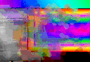

# unnamed.png
unnamed.png -- original artwork of mine from Apple Macintosh Sample Code I wrote in the early 90s

---

Someone found an old original digitial painting I made for Apple Computer when I worked their in the early 90s for official sample code published on their developer CDs for the 68k reigning Mac legacy. It was so nice to receive this, I had to publish it again right away.

**funny enough, Apple Computer, Inc. probably has the (c) on this image! Thanks apple ♥️ u!**

In the spirit of long lived sample code here are two apps, one HTML and the other a rust desktop app.

---

## Demo Commands:

| Action | Effect |
|--------|--------|
| click and drag edges | resize |
| double click | fullscreen on current display |

## HTML
Serve index.html from your favorite browser, or view it at 

https://brighams.github.io/unnamed.png

## RUST
rust build & run:

``
./rust.sh 
``
## Enjoy

---
``
orbit-d0d-main-version-29627-02-39.mp3
``
``
Free Music from #Uppbeat License code: 8CWB22QJHCXO9EWR*
``
